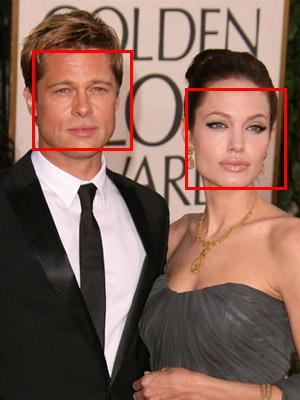

SimpleFaceDetector
==================

A simple face detection tool for the COMP6223 coursework.

## Running the detector
SimpleFaceDetector is a Java application. You need to have Java 1.6 or greater installed to use it. Java can be downloaded and installed from the [Oracle Java SE downloads page](http://www.oracle.com/technetwork/java/javase/downloads/index.html).

## Running with a webcam
If you have a webcam, the SimpleFaceDetector can use it to capture images and highlight detected faces. You should be able to just double click on the `SimpleFaceDetector-1.0-tool.jar` file to launch it. Alternatively, it can be launched from a command prompt with the following command: 
	
	java -jar SimpleFaceDetector-1.0-tool.jar

When the tool launches, it will connect to the first webcam it sees and display the image. A red box will be drawn around any detected faces. Pressing the space bar will pause the video, and pressing again will unpause it. Pressing the `s` key will allow you to save the current image to a file.

## Using your own images
The SimpleFaceDetector tool also contains a command-line mode that allows it to read an image, detect faces and save the result. To do this, the following command can be used from a command prompt:

	java -jar SimpleFaceDetector-1.0-tool.jar <input_image> <output_image>

For example, to detect faces in the [faces.jpg](faces.jpg) file and save the result to [faces-detections.jpg](faces-detections.jpg) one would run: 

	java -jar SimpleFaceDetector-1.0-tool.jar faces.jpg faces-detections.jpg

The original and resultant images are shown below:

	
	

